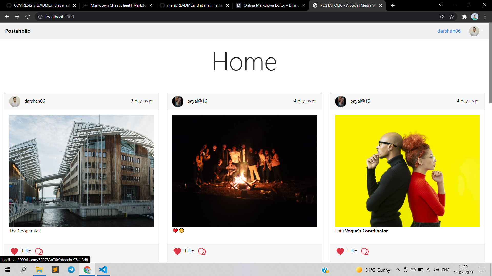
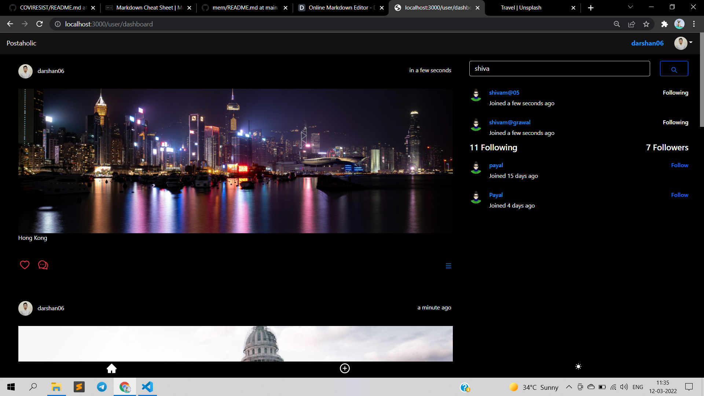

# 🌐 Postaholic
- **A Social Network Website** made using **Next.js** for front-end and back-end on **Node.js** and **Express.js**.
- Used **React-Routers** and **Node.js API** for effortless **CRUD** operations, **Bootstrap** and **ANT Design** for user-friendly UI and **MongoDB** for the database.
- Implement Authentication using **JWT** and utilized **React-context-API** to acsess logged-in user's information globally.
- Carry out *Password Reset workflow* using **otplib(TOTP)** library and **nodemailer** for Email Automation.

## clone or download
```terminal
$ git clone https://github.com/agrawallaDarshan/Postaholic.git
$ npm i
```

## project structure
```terminal
LICENSE
package.json
server/
   package.json
   .env (to create .env, check [prepare your secret session])
client/
   package.json
   .env (to create .env, check [prepare your secret session])
...
```

# Usage (run fullstack app on your machine)

## Prerequisites
- [MongoDB](https://gist.github.com/nrollr/9f523ae17ecdbb50311980503409aeb3)
- [Node](https://nodejs.org/en/download/) ^10.0.0
- [npm](https://nodejs.org/en/download/package-manager/)

**notice**, *you need client and server runs concurrently in different terminal session, in order to make them interactive and update the cors if you are hosting the client in any other port rather than 3000.*

## Client-side usage(PORT: 3000)
```terminal
$ cd client   // go to client folder
$ npm i       // npm install packages
$ npm run dev // run it locally

// deployment for client app
$ npm run build // this will compile the client side code using webpack and generate a folder called public(you can rename) in the root level
```

## Server-side usage(PORT: 8000)

### Prepare your secret

run the script at the first level:

(You need to add a JWT_SECRET in .env to connect to MongoDB)

```terminal
// in the root level
$ echo "JWT_SECRET=YOUR_JWT_SECRET" >> ./server/.env
```

### Start

```terminal
$ cd server   // go to server folder
$ npm i       // npm install packages
$ npm start   // run it locally
```

## Deploy Server to [Heroku](https://dashboard.heroku.com/)
```terminal
$ npm i -g heroku
$ heroku login
...
$ heroku create
$ npm run heroku:add <your-super-amazing-heroku-app>
// remember to run this command in the root level, not the server level, so if you follow the documentation along, you may need to do `cd ..`
$ pwd
/Users/<your-name>/mern
$ npm run deploy:heroku
```

### After creating heroku

remember to update the file of **client/.env.local/**
```javascript
 NEXT_PUBLIC_API: https://socialmedia-server.herokuapp.com/api
```

# Dependencies(tech-stacks)
Client-side | Server-side
--- | ---
@ant-design/icons: ^4.7.0 | bcrypt: ^5.0.1  
antd: ^4.17.3 | cloudinary: ^1.28.0
axios: ^0.23.0 | cors: ^2.8.5 
bootstrap: ^5.1.3 | dotenv: ^10.0.0
cloudinary-react: ^1.7.0 | es6: 0.0.7 
dotenv: ^10.0.0 | express: ^4.17.1
firebase: ^9.6.7 | express-formidable: ^1.2.0 
moment: ^2.29.1 | express-jwt: ^6.1.0
next: ^11.1.2 | jsonwebtoken: ^8.5.1 
react: ^17.0.2 | mongoose: ^6.0.12
react-dom: ^17.0.2 | morgan: ^1.10.0 
react-icons: ^4.3.1 | nodemailer: ^6.7.2
react-moment": ^1.1.1 | nodemon: ^2.0.14 
react-quill: ^1.3.5 | otplib: ^12.0.1
socket.io-client: ^4.4.1 | socket.io: ^4.4.1
react-render-html: ^0.6.0 |
react-toastify: ^8.1.0 |

# Screenshots of this project

User visit public / Home page



User can sign in or sign up



Highly Responsive Designs


## Hosted Link

[Postaholic](https://mernstack-frontend-24efe.web.app/)

## Standard

[](https://github.com/standard/standard)

## BUGs or comments

[Create new Issues](https://github.com/agrawallaDarshan/Postaholic/issues) (preferred)

Email Me: darshanagrawallaabc01@gmail.com (welcome, say hi)

## Author
[agrawallaDarshan](https://github.com/agrawallaDarshan)

### License
[MIT](https://github.com/agrawallaDarshan/Postaholic/blob/master/LICENSE)